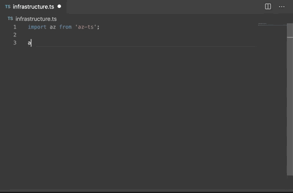
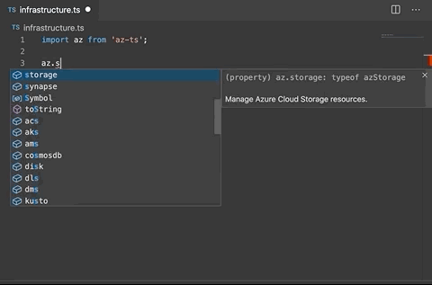
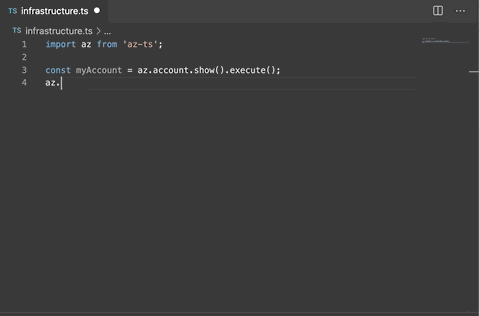

**This project is a work in progress**

---

# az-ts

This ambitious project aims to be a full 1 to 1 typescript replacement for the
existing azure cli.



## Why

The [azure-cli](https://github.com/Azure/azure-cli) is great, but when creating infrastructure deployment scripts,
it's not always the smoothest experience bouncing back and forth between the
interactive cli and your code.

Typescript provides an experience that makes the cli easier to explore from
within your code.

## Features

**Fully typed easy to explore command heirarchy**



**Fully typed responses from the azure cli**



## Installation & Usage

You will need to have the az cli installed, and accessible via the command `az`.

_(If you currently run the cli from docker, or specify a command path to the
cli, you will need to create an alias as this project attempts to use `az` on
your behalf. Specifiying a path or a command to use is on the todo list.)_

Install the project locally

```sh
npm install --save az-ts@latest
```

Install the project globally to run the az-ts command

```sh
npm install -g az-ts@latest
```

Now you can create a new typescript file, and import az;

```ts
/* create-webapp.ts */

import az from "az-ts";

// create an app service plan
az.appservice.plan
  .create("appServicePlanName", "resourceGroupName")
  .sku("F1")
  .location("canadacentral")
  .execute();

// create the webapp
az.webapp
  .create("webappName", "appServicePlanName", "resourceGroupName")
  .execute();

// allow the webapp to access other resources by using a system managed identity
az.webapp.identity
  .assign()
  .name("webappName")
  .resourceGroup("resourceGroupName")
  .identities("[system]")
  .execute();
```

Now you can log in to azure via the cli, and run az-ts on your typescript file

```sh
az login

az-ts ./create-webapp.ts
```
